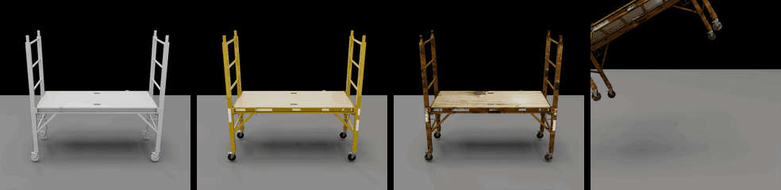
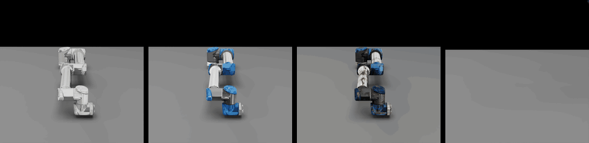
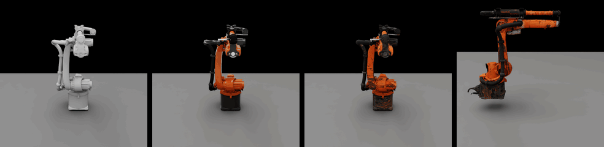

# Content Agents

AI-powered agents for automating 3D content workflows using Vision-Language
Models (VLMs). Content Agents analyze 3D assets, automate material assignment,
classify physics properties, generate textures, and validate generated content
for [Universal Scene Description (USD)](https://openusd.org/) files.








Each GIF shows one asset: cleaning trolley, electrician's toolbox, steel rolling scaffold, UR10, and KUKA arm. Columns: input gray asset, Material Agent material assignment, Texture Agent rusty texture pass, Physics Agent physical properties and drop simulation.

## Platform Support

Content Agents are supported on Linux, Linux containers, and WSL2 on Windows.
Native Windows shell execution is not an official runtime target for the agent
CLIs, local rendering, OVRTX, or physics daemon paths in this release line.

Windows-style path parsing may appear in tests or utility code so USD assets
and archives remain portable, but that does not imply native Windows execution
support. Treat native Windows support as future planned work that needs an
approved design and CI/security plan before implementation.

Local USD validation uses `usd-validation-nvidia`. Agent profiles include shared
schema coverage (`Basic`, `Layer`, `Layout`, `Other`) and then add the rule
group for authored changes. Pre-validation can apply validator auto-fix
suggestions when available, revalidate the repaired USD, and continue with the
repaired file.

## Agents

### Material Agent (Beta)

Assigns physically-based materials to 3D objects by analyzing multi-view renders with a VLM. Given a USD file and a material library, the Material Agent identifies object parts, selects appropriate materials, and applies them back to the USD file.

- Multi-view rendering and VLM-based material prediction
- Material library matching with fuzzy validation
- Scene pipeline for large multi-asset USD files
- RAG enhancement with technical specification documents
- Local USD validation coverage for schema (`Basic`, `Layer`, `Layout`,
  `Other`) and `Material` rule groups

### Physics Agent (Beta)

Classifies physical properties of 3D asset components for physics simulation. Analyzes rendered views to identify component types, surface materials, and physical characteristics.

- Component-level classification (material, type, physics properties)
- Asset-type-aware analysis (vehicles, robots, props)
- Structured prediction output for downstream simulation
- Local USD validation coverage for schema (`Basic`, `Layer`, `Layout`,
  `Other`) and `Physics` rule groups

### Texture Agent (Research Preview)

Generates and applies AI-driven texture maps to USD materials. Takes a materialized USD file (e.g., output of the Material Agent) and fills empty texture slots with generated textures, transforming flat-color surfaces into visually rich textured ones.

- Texture generation for OpenPBR, MaterialX, and MDL-style material metadata
- Per-material or per-prim texture modes
- Texture blending and compositing
- Local USD validation coverage for schema (`Basic`, `Layer`, `Layout`,
  `Other`) and `Material` rule groups, with UV readiness covered by the
  preparation report

### Validation Agent (Research Preview)

Validates generated USD, render, image, video, and physics-evidence artifacts
with release-scoped CLI/Python contracts. Validation Agent is the release-gate
tool for checking whether generated assets render correctly, look like their
prompt or reference evidence, have sane authored physics, or have approved
behavior evidence.

- Prompt-driven `validation-agent validate --task ... INPUT...` runs
- Config-driven `validation-agent run CONFIG` runs for repeatable QA
- Structured `validation_request.json`, `validation_plan.json`, and
  `validation_result.json` artifacts for CI and review

## Two Ways to Use This

Material, Physics, and Texture ship in two shapes. Both run the same
underlying pipeline, VLM prompts, and rendering logic — they differ only in how
you drive them. Validation Agent V1 is CLI/Python-contract first for release
0.4; REST, OpenAPI, and hosted service surfaces are not part of the V1 release
scope.

### Option A — REST service (Docker Compose)

Material, Physics, and Texture each have a matching FastAPI service
(`apps/<agent>_service/`) packaged with a `docker-compose.yml` that also starts
the bundled GPU rendering sidecar. Bring the stack up with `docker compose up`,
then drive the pipeline over HTTP from any language — using the included Python
client or the OpenAPI spec.

**Pick this when:** you want the fastest "submit a USD, get results back" experience on a single GPU box, or you're calling from an existing application.

### Option B — Local CLI

Install the agent's Python package (`material-agent`, `physics-agent`,
`texture-agent`, `validation-agent`) and invoke `<agent> run CONFIG` against a
local YAML config. The CLIs expose agent-specific controls such as skip steps,
resume partial runs, prompt tuning, prim-path targeting, validation templates,
and rendering-backend selection. For texture generation,
`texture-agent run --resume` reuses generated artifacts in the configured
working directory; `texture-agent generate` followed by `texture-agent apply`
is the explicit two-step resume path after generation succeeds.

**Pick this when:** you want fine-grained control over pipeline steps, you're iterating on configs, running supported benchmarks, or wiring the pipeline into scripted workflows. Batch and benchmark helpers are agent-specific; texture-agent runs one config at a time and can be scripted externally for multi-asset batches.

Under the hood, the REST service wraps the same pipeline steps the CLI runs, so configs and findings port between the two. Most users start with Option A for a quick win, then drop into Option B when they need deeper control.

## Use a Coding Agent

The Codex app, [Codex CLI](https://developers.openai.com/codex/cli), [Claude Code CLI](https://docs.claude.com/en/docs/claude-code/cli-usage), and [OpenClaw CLI](https://docs.openclaw.ai/cli) can each set up this repo end to end: inspect the docs, check prerequisites, install the CLI path, configure `.env`, run a first example, and diagnose missing render or API-key setup.

If you use a local coding agent, start it from the cloned repository root. Keep
API keys in `.env`, review commands before approval, and avoid pasting secrets
directly into chat.

For the shortest local service path, ask the agent to use `/quickstart`. It
starts one existing per-agent Docker Compose stack: Material, Physics, or
Texture. Use `deploy-collection` for the full package with shared dependency
endpoints.

Install and sign in to your preferred agent first (`codex login`,
`claude auth login`, or `openclaw setup`, as applicable).

For the simplest path, paste this prompt:

```text
Set up this repo for me, then run the material-agent hello-world example. If
anything fails, tell me exactly what prerequisite or API key is missing and the
next command I should run.
```

For a more explicit setup, paste this prompt:

```text
Set up NVIDIA Content Agents in this repository for me.

1. Inspect README.md, .env_example, and the agent README files under apps/.
2. Check whether this machine has Docker Compose v2.24+, Python 3.12+, uv,
   NVIDIA drivers, and the NVIDIA Container Toolkit.
3. Create .env from .env_example if it does not exist. Tell me which VLM API
   key is missing — do not print or expose secrets.
4. Install the local CLI path with uv and fetch build resources, or start the
   material agent REST service with Docker Compose if the machine is better
   suited for Docker.
5. Run a hello-world example:
   material-agent run apps/material_agent/configs/unified_example.yaml
6. If the run fails, diagnose the exact missing prerequisite, render backend,
   or API key, then give me the next command to fix it.
```

Or launch the agent with a shorter inline prompt:

```bash
# Codex app
# Open this folder in the Codex app, then paste a prompt above.

# Codex CLI
codex "Set up NVIDIA Content Agents in this repo and run the material-agent hello-world example. If anything fails, tell me the missing prerequisite or API key and the next command to fix it."

# Claude Code CLI
claude "Set up NVIDIA Content Agents in this repo and run the material-agent hello-world example. If anything fails, tell me the missing prerequisite or API key and the next command to fix it."

# OpenClaw CLI
openclaw agent --local --session-id content-agents-setup -m "Set up NVIDIA Content Agents in this repo and run the material-agent hello-world example. If anything fails, tell me the missing prerequisite or API key and the next command to fix it."
```

Command names above follow the
[Codex CLI](https://developers.openai.com/codex/cli),
[Claude Code CLI](https://docs.claude.com/en/docs/claude-code/cli-usage), and
[OpenClaw CLI](https://docs.openclaw.ai/cli) references.

### Bundled Agent Skills

This repo includes checked-in skill guides for Codex and Claude Code. Start
from the repo root so your agent can load the right skill folder. The canonical
skill tree is `.agents/skills/`; `.codex/skills/` and `.claude/skills/` are
compatibility mirrors.

| Task | Codex path | Claude path | Use when |
|---|---|---|---|
| Material Agent CLI | `.codex/skills/material-agent-cli` | `.claude/skills/material-agent-cli` | Assign materials to a USD asset or run the material pipeline. |
| Material Agent service/client | `.codex/skills/material-agent-client` | `.claude/skills/material-agent-client` | Drive the REST service from Python or curl. |
| Physics Agent CLI | `.codex/skills/physics-agent-cli` | `.claude/skills/physics-agent-cli` | Classify component materials and physics properties. |
| Physics Agent service/client | `.codex/skills/physics-agent-client` | `.claude/skills/physics-agent-client` | Drive the physics REST service. |
| Texture Agent CLI | `.codex/skills/texture-agent-cli` | `.claude/skills/texture-agent-cli` | Generate and apply textures to USD materials. |
| Texture Agent service/client | `.codex/skills/texture-agent-client` | `.claude/skills/texture-agent-client` | Drive the texture REST service. |
| Validation Agent CLI | `.codex/skills/validation-agent-cli` | `.claude/skills/validation-agent-cli` | Validate generated USD, render, image, video, and physics-evidence artifacts. |
| OVRTX rendering | `.codex/skills/deploy-ovrtx-docker` | `.claude/skills/deploy-ovrtx-docker` | Start or target an OVRTX render endpoint. |
| USD utilities | `.codex/skills/flatten-usd`, `.codex/skills/print-usd`, `.codex/skills/render-usd` | `.claude/skills/flatten-usd`, `.claude/skills/print-usd`, `.claude/skills/render-usd` | Inspect, flatten, or render USD assets. |

### Agent Follow-Up Prompts

After setup, ask your coding agent to run one of these:

```text
Run the material-agent hello-world ladder example. If rendering fails, check
whether RENDER_ENDPOINT is configured, then tell me the shortest path to a
working render backend.
```

```text
Bring my own USD asset into the material agent. Create a new config from
apps/material_agent/configs/unified_example.yaml, point input.usd_path at
/absolute/path/to/my_asset.usd, add my reference images from
/absolute/path/to/reference_images/, and run the pipeline.
```

```text
Create a physics-agent config for /absolute/path/to/my_asset.usd based on
apps/physics_agent/configs/lightbulb.yaml, then run physics-agent and summarize
the generated predictions and report path.
```

```text
Run the texture-agent example config. If image generation is not configured,
tell me which backend or API key is missing and where the generated texture
artifacts would be written after a successful run.
```

```text
Run the validation-agent hello-world behavior-evidence example:
apps/validation_agent/examples/configs/steel_scaffold_behavior_refine_summary.yaml.
Then summarize the verdict and point me to validation_result.json.
```

## Quick Start

### System Requirements

The material and physics agents bundle a GPU-accelerated rendering sidecar
(OVRTX). The texture agent service is CPU-only and offloads image
generation to the configured backend.

| Resource | Default deployment (material / physics) | + Local VLM NIM sidecar (material only) | Texture agent service |
|---|---|---|---|
| **GPU** | 1× RTX-capable NVIDIA GPU with **48 GB VRAM** (e.g., L40, L40S, RTX PRO 6000) | Add a 2nd 48 GB NVIDIA GPU for the local VLM | None with hosted backends; +1 NVIDIA GPU per enabled local sidecar (see below) |
| **CPU** | 10 vCPU | 16 vCPU | 4 vCPU |
| **System RAM** | 20 GB | 56 GB | 8 GB |
| **OS** | Linux x86_64 on a distro supported by the [NVIDIA Container Toolkit](https://docs.nvidia.com/datacenter/cloud-native/container-toolkit/install-guide.html); Windows via WSL2 (Scene Optimizer Core ships Linux x86_64); macOS is not supported for the rendering / optimize pipeline | Same | Same |
| **NVIDIA driver** | Recent production driver compatible with the NVIDIA Container Toolkit | Same | Not required for hosted backends; required when running local sidecars |

The local VLM NIM sidecar (`--profile vlm`, Cosmos Reason 2 8B) ships
only with the material agent service. The physics agent service uses
the hosted VLM backend configured via `PA_VLM_BACKEND` and does not
include a public `vlm-nim` profile.

A100, H100, H200, and V100 class GPUs are useful model-serving targets, but
they are not supported as the local OVRTX render GPU for the default
material/physics Docker deployment.

The texture agent service is CPU-only out of the box, but ships two
optional NIM sidecars that **do** require a GPU when enabled. Running
them locally needs the `docker-compose.multi-gpu.yml` overlay — without
it the sidecar containers start but the texture service keeps talking
to the hosted backends, because the overlay is what rewrites
`TA_IMAGE_GEN_BASE_URL` / `TA_LLM_BASE_URL` to point at the local NIMs.

| Profile | GPU | Extra CPU | Extra RAM | Tokens needed |
|---|---|---|---|---|
| `--profile image-gen` (FLUX.2 Klein 4B) | 1× NVIDIA GPU, ≥24 GB VRAM | +4 vCPU | +16 GB | `NGC_API_KEY`, `HF_TOKEN` |
| `--profile llm` (Llama 3.1 Nemotron Nano 8B) | 1× NVIDIA GPU, 48 GB VRAM | +4 vCPU | +16 GB | `NGC_API_KEY` |

```bash
# Authenticate with NGC so Docker can pull the NIM images. Use
# --password-stdin to keep the API key out of process argv / shell logs.
printf '%s' "$NGC_API_KEY" | docker login nvcr.io \
  --username '$oauthtoken' --password-stdin

# Run both sidecars (the overlay rewrites both TA_*_BASE_URL values
# unconditionally, so enabling only one profile would point the service
# at a sidecar that isn't running). `--env-file .env` is required so
# that the compose `${VAR}` overrides read your repo-root `.env`.
docker compose --env-file .env \
               -f apps/texture_agent_service/docker-compose.yml \
               -f apps/texture_agent_service/docker-compose.multi-gpu.yml \
               --profile image-gen --profile llm up --build
```

To run only one sidecar locally, write a per-profile compose override or
edit `apps/texture_agent_service/docker-compose.multi-gpu.yml` directly —
the bundled overlay assumes both sidecars are enabled.

Cold-start GPU warm-up for the bundled `ovrtx-rendering-api` sidecar takes
~5 minutes; the local VLM NIM (when enabled) takes ~15 minutes on first
run for model compilation.

### Software Prerequisites

- For Option A: [NVIDIA Container Toolkit](https://docs.nvidia.com/datacenter/cloud-native/container-toolkit/install-guide.html) + Docker Compose **v2.24+** (earlier versions don't support the `env_file: required: false` long-form syntax used by the compose files).
- For Option B: Python 3.12+ and [`uv`](https://docs.astral.sh/uv/getting-started/installation/) in a Linux/WSL shell. Install `uv` with:
  ```bash
  curl -LsSf https://astral.sh/uv/install.sh | sh
  ```
- An API key for at least one VLM provider (see [Supported VLM Backends](#supported-vlm-backends))

### Clone the Repository

```bash
git clone https://github.com/NVIDIA-Omniverse/content-agents.git
cd content-agents
```

### Environment Setup

Copy `.env_example` to `.env` at the repo root and add your VLM provider key:

```bash
cp .env_example .env
```

```bash
# Pick one (or more) VLM providers:

# NVIDIA NIM (https://build.nvidia.com/)
NVIDIA_API_KEY=nvapi-...

# OpenAI (https://platform.openai.com/api-keys)
OPENAI_API_KEY=sk-...

# Anthropic (https://console.anthropic.com/settings/keys)
ANTHROPIC_API_KEY=sk-ant-...

# Google Gemini (https://aistudio.google.com/apikey)
GOOGLE_API_KEY=AIza...
# GEMINI_API_KEY is also accepted as an alias.
```

The shipped material-agent example
`apps/material_agent/configs/unified_example.yaml` defaults to
`predict.vlm.backend: nim` and `predict.llm.backend: nim`, so the unedited
command requires `NVIDIA_API_KEY`. To run that same config with another
provider, set both the backend and model overrides in `.env` (or edit the YAML):

```bash
MA_VLM_BACKEND=openai
MA_VLM_MODEL=gpt-4o
MA_LLM_BACKEND=openai
MA_LLM_MODEL=gpt-4o
```

### Option A — Run via Docker Compose

Each REST-capable agent's service directory holds a `docker-compose.yml` you can bring up directly. First boot takes ~5 minutes for the bundled rendering sidecar to warm up on the GPU.
Validation Agent does not ship a Docker Compose service in release 0.4; run it
through the local CLI.

When using a coding agent, `/quickstart` wraps these same per-agent compose
commands for a single-service POC. Use `deploy-collection` for a coordinated
Material, Physics, and Texture deployment.

`--env-file .env` is required so that any `${VAR}` overrides in the
compose files (e.g. `MA_VLM_BACKEND=openai`) read from the repo-root
`.env` you created above. Without it, Compose's variable substitution
looks for `.env` next to the compose file (e.g.
`apps/material_agent_service/.env`) and silently falls back to the
built-in defaults — your `.env` API keys still load via `env_file:`,
but any backend / model overrides you set there do not take effect.

```bash
# Material agent
docker compose --env-file .env \
  -f apps/material_agent_service/docker-compose.yml up --build
# Health check
curl http://localhost:8000/health

# Physics agent (different service, same pattern)
docker compose --env-file .env \
  -f apps/physics_agent_service/docker-compose.yml up --build

# Texture agent
docker compose --env-file .env \
  -f apps/texture_agent_service/docker-compose.yml up --build
```

Once a service is up, drive it via HTTP or the included Python client in `apps/<agent>_service/client/`. See each service's `README.md` and `docs/api.md` for endpoint details.

Material-agent service also exposes the large-scene workflow through
`POST /pipeline` by setting `large_scene=true`. The same mode is available
through the included client. Large-scene input is one composed USD stage with a
valid default root prim, not a collection of USD files. Upload one USD-family
root stage; use USDZ when dependencies need to travel with the scene. A small
synthetic quickstart is available in
`apps/material_agent_service/examples/large_scene/README.md`:

```bash
python -m apps.material_agent_service.client.client \
  --base-url http://localhost:8000 \
  --email user@example.com \
  --large-scene \
  --scene-workers 2 \
  --vlm-max-workers 8 \
  --scene-fail-on-validation-error \
  /absolute/path/to/large_scene.usda
```

### Option B — Run via CLI

Three steps: (1) set up the virtual environment, (2) install everything,
(3) run the agent. All commands run from the repo root.

**1. Set up the virtual environment**

```bash
uv venv --python=3.12
source .venv/bin/activate
```

**2. Install — both the pip packages and the Scene Optimizer Core binary**

```bash
# Core library + one or more agents
uv pip install -e . -e apps/material_agent -e apps/physics_agent -e apps/texture_agent -e apps/validation_agent

# Fetch the public Scene Optimizer Core package (~332 MB, one-time, cached
# at .build-resources/scene_optimizer_core/). Required for the
# material-agent `optimize_usd` step's default local backend.
#
# Windows users should run this from WSL2; native Windows shell execution is
# not supported for the full CLI pipeline.
./scripts/fetch_build_resources.sh
```

**3. Run an example**

```bash
# Requires NVIDIA_API_KEY unless you set MA_VLM_* and MA_LLM_* overrides.
material-agent run apps/material_agent/configs/unified_example.yaml
physics-agent run apps/physics_agent/configs/lightbulb.yaml
texture-agent run apps/texture_agent/configs/texture_example.yaml
# Validation Agent hello-world: checked-in behavior evidence, no renderer or
# VLM key required.
validation-agent run \
  apps/validation_agent/examples/configs/steel_scaffold_behavior_refine_summary.yaml
```

Texture-agent also supports staged `discover`, `generate`, and `apply`
commands for preflight material inspection and generate-then-apply workflows.
Validation-agent examples include a hello-world checked-in behavior-evidence
config plus public SimReady electrician's toolbox and steel rolling scaffold
validation flows under `apps/validation_agent/examples/`; they consume
downloaded public assets or checked-in evidence fixtures and do not require
running the other agents first.

Multi-view renders the agents send to the VLM are encoded inline as data
URIs by default — no cloud storage is required. If you want to upload
renders to S3 instead, set `WU_S3_BUCKET` (plus AWS credentials). See
`.env_example` for all toggles.

See each agent's `README.md` under `apps/<agent>/` for the full CLI reference, config conventions, and per-step options.

## Bring Your Own Asset

Once a hello-world example runs cleanly, point an agent at your own USD: copy a known-good config and edit the asset path. Use absolute paths for files outside the repo — `~` is not expanded by the config loader.

```bash
# Material agent: assign materials to a USD asset.
cp apps/material_agent/configs/unified_example.yaml \
   apps/material_agent/configs/my_asset_materials.yaml
# Edit input.usd_path and input.reference_images in my_asset_materials.yaml.
material-agent run apps/material_agent/configs/my_asset_materials.yaml

# Physics agent: classify components and physical properties.
cp apps/physics_agent/configs/lightbulb.yaml \
   apps/physics_agent/configs/my_asset_physics.yaml
# Edit input.usd_path in my_asset_physics.yaml.
physics-agent run apps/physics_agent/configs/my_asset_physics.yaml

# Texture agent: add generated textures to a materialized USD.
cp apps/texture_agent/configs/texture_example.yaml \
   apps/texture_agent/configs/my_asset_textures.yaml
# Edit input.usd_path and texture settings in my_asset_textures.yaml.
texture-agent run apps/texture_agent/configs/my_asset_textures.yaml

# Validation agent: validate an existing generated USD or evidence bundle.
validation-agent validate \
  --task "Validate that this asset renders successfully." \
  --template render_valid \
  --render-backend remote \
  --render-view corner \
  --output-dir .validation-runs/my_asset \
  /absolute/path/to/generated_asset.usd
```

Use a Validation Agent config when the release gate needs live `look_right`
reference judging, because the VLM judge policy lives in the request config.

For a Docker/service workflow, Material, Physics, and Texture users start the
matching `apps/<agent>_service` Compose stack and reference the USD through the
service client in `apps/<agent>_service/client/`. Validation Agent has no
matching service or Compose stack in release 0.4; use the CLI path above.

## Supported VLM Backends

| Backend | Provider | Environment Variable |
|---------|----------|---------------------|
| `nim` | [NVIDIA NIM](https://build.nvidia.com/) | `NVIDIA_API_KEY` |
| `openai` | [OpenAI](https://platform.openai.com/) | `OPENAI_API_KEY` |
| `anthropic` | [Anthropic](https://console.anthropic.com/) | `ANTHROPIC_API_KEY` |
| `gemini` | [Google Gemini](https://aistudio.google.com/) | `GOOGLE_API_KEY` or `GEMINI_API_KEY` |

Configure Material, Physics, and Texture backends in the agent YAML config
under the `predict` or generation section. Validation Agent uses
`policy.look_right_vlm` / `policy.look_right_llm_judge` for visual judging and
the shared render settings (`RENDER_ENDPOINT` or `NVCF_RENDER_FUNCTION_ID`) for
runtime USD visual evidence.

## Project Structure

```
content-agents/
├── world_understanding/        # Core library (tools, functions, agentic framework)
├── apps/
│   ├── material_agent/         # Material assignment agent (CLI)
│   ├── material_agent_service/ # Material agent REST API service
│   ├── physics_agent/          # Physics property classification agent (CLI)
│   ├── physics_agent_service/  # Physics agent REST API service
│   ├── texture_agent/          # Texture generation agent (CLI)
│   ├── texture_agent_service/  # Texture agent REST API service
│   ├── validation_agent/       # Validation Agent (CLI)
│   └── ovrtx_rendering_api/    # OVRTX-based rendering service
└── tests/                      # Test suite
```

## Documentation

- **Per-agent docs**: `apps/<agent>/README.md` covers the CLI (Option B). For
  material and physics, `apps/<agent>/docs/api.md` is the programmatic Python
  API reference. Texture agent has no Python API module; use the CLI or the
  REST service. Validation Agent V1 is CLI/Python-contract only and documents
  examples in `apps/validation_agent/examples/`.
- **Per-service docs**: `apps/<agent>_service/README.md` covers Docker Compose
  deployment (Option A); `apps/<agent>_service/docs/api.md` is the REST API
  reference. Validation Agent does not ship a REST service in release 0.4.
- **Material agent Docker deep-dive**: `apps/material_agent_service/docs/docker.md` covers multi-GPU, VLM-NIM sidecars, and production profiles.

## Development

```bash
# Install dev dependencies
uv pip install -e ".[dev]"

# Run tests
pytest

# Format and lint
./format.sh

# Check only (CI mode)
./format.sh check
```

## License

Licensed under the [Apache License, Version 2.0](LICENSE). Third-party
component licenses are listed in [THIRD_PARTY_NOTICE.md](THIRD_PARTY_NOTICE.md).

## Contributing

This project is currently not accepting contributions. See
[CONTRIBUTING.md](CONTRIBUTING.md).

## Security

Please report security vulnerabilities per the policy in
[SECURITY.md](SECURITY.md).

## Code of Conduct

This project adheres to the Contributor Covenant Code of Conduct. See
[CODE_OF_CONDUCT.md](CODE_OF_CONDUCT.md).
